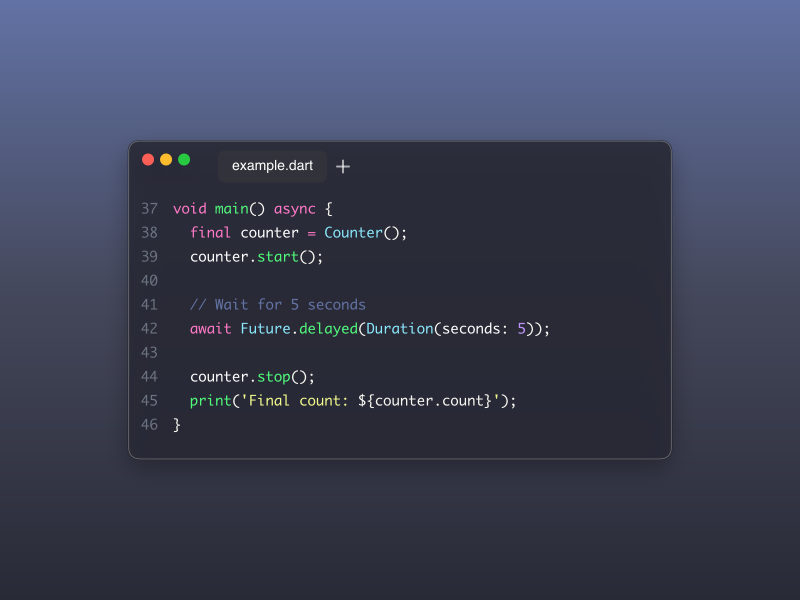
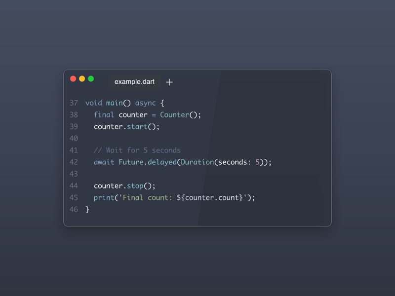
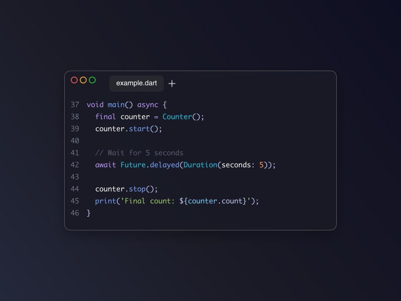
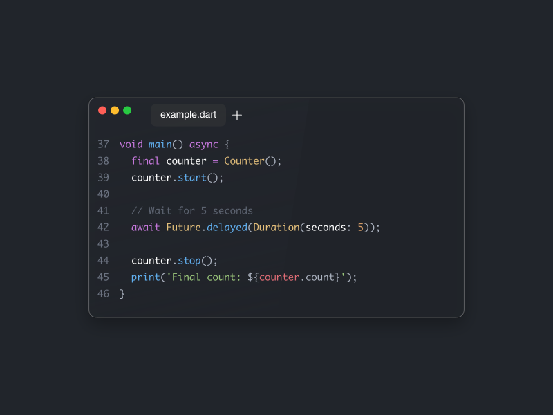

# Code Snapshot Generator

A TypeScript project that creates beautiful code snapshots with Dart syntax highlighting, similar to the image you provided. The generator creates a semi-transparent card with syntax-highlighted code on a gradient background.

## Showcase

Here are some examples of what you can create:

<div align="center">
  
  
  
</div>

## Features

- 🎨 Beautiful gradient background
- 📄 Semi-transparent code card with rounded corners
- 🎯 Dart syntax highlighting support
- 📝 Line numbers
- 💾 Outputs high-quality PNG images
- 🖼️ Similar styling to the reference image
- 🌈 11 included popular themes (Dracula, GitHub Dark, Material Dark, Nord, Tokyo Night, One Dark, Monokai, Cyberpunk, Sunset, Lint Showcase, Lint Messages)
- 🚀 One-command theme generation with `npm run examples`

## Installation

1. Install dependencies:

```bash
npm install
```

2. Build the project:

```bash
npm run build
```

## Usage

### Development Mode

```bash
npm run dev <path-to-config-file>
```

### Production Mode

```bash
npm run start <path-to-config-file>
```

### Examples

Generate a snapshot using the default config:

```bash
npm run dev ./config.yaml
```

Generate a snapshot with custom config:

```bash
npm run dev ./my-config.yaml
```

Generate snapshots using included themes:

```bash
# Generate all theme examples at once
npm run examples

# Or generate individual themes:
# Dracula theme
npm run dev ./assets/themes/dracula.yaml

# GitHub Dark theme
npm run dev ./assets/themes/github-dark.yaml

# Material Dark theme
npm run dev ./assets/themes/material-dark.yaml

# Nord theme
npm run dev ./assets/themes/nord.yaml

# Tokyo Night theme
npm run dev ./assets/themes/tokyo-night.yaml

# One Dark theme
npm run dev ./assets/themes/one-dark.yaml

# Monokai theme
npm run dev ./assets/themes/monokai.yaml

# Cyberpunk theme
npm run dev ./assets/themes/cyberpunk.yaml

# Sunset theme
npm run dev ./assets/themes/sunset.yaml

# Lint Showcase theme
npm run dev ./assets/themes/lint-showcase.yaml

# Lint Messages theme
npm run dev ./assets/themes/lint-messages.yaml
```

## Configuration

The generator uses YAML configuration files to specify input, output, and styling options. We've included several popular themes in the `assets/themes/` directory that you can use as starting points:

### Included Themes

- **Dracula** (`assets/themes/dracula.yaml`) - Classic dark purple theme with lint messages
- **GitHub Dark** (`assets/themes/github-dark.yaml`) - GitHub's dark theme with hidden controls
- **Material Dark** (`assets/themes/material-dark.yaml`) - Material Design with blur effects
- **Nord** (`assets/themes/nord.yaml`) - Arctic-inspired 3-color gradient
- **Tokyo Night** (`assets/themes/tokyo-night.yaml`) - Minimal dark blue theme
- **One Dark** (`assets/themes/one-dark.yaml`) - Popular Atom theme with lint messages
- **Monokai** (`assets/themes/monokai.yaml`) - Classic high-contrast theme
- **Cyberpunk** (`assets/themes/cyberpunk.yaml`) - Futuristic neon theme with vibrant colors
- **Sunset** (`assets/themes/sunset.yaml`) - Warm gradient theme with orange and purple tones
- **Lint Showcase** (`assets/themes/lint-showcase.yaml`) - Dark theme with visual lint indicators on code
- **Lint Messages** (`assets/themes/lint-messages.yaml`) - Clean theme with detailed lint messages display

```yaml
# Code Snapshot Configuration
input:
  file: "./example.dart" # Path to Dart file
  startLine: 37 # Starting line number (inclusive)
  endLine: 46 # Ending line number (inclusive)

output:
  path: "./code-snapshot.png" # Output file path
  width: 800 # Image width (null = auto-size)
  height: 600 # Image height (null = auto-size)

styling:
  cardTransparency: 0.8 # Card transparency (0.0-1.0)
  backgroundColor: "#1e3a8a" # Dark blue for gradient
  gradientMiddleColor: "#3b82f6" # Medium blue for gradient middle
  showLineNumbers: true # Show line numbers
  fileName: "index.dart" # File name to display in header (null/undefined to hide)
  fileIcon: null # Path to custom icon file (e.g., "./assets/dart-icon.png")
  windowControl: "filled" # "filled", "outlined", or "hidden"
  cardMargin:
    horizontal: 40 # Horizontal margin around the card
    vertical: 40 # Vertical margin around the card
```

### VS Code IntelliSense

For better editing experience, you can add the included JSON schema to your VS Code settings. See [VSCODE_SETUP.md](./VSCODE_SETUP.md) for detailed instructions.

## Example Output

The generator creates beautiful PNG images with:

- Gradient backgrounds with customizable colors
- Semi-transparent cards with rounded corners and macOS-style window controls
- Syntax-highlighted code with optional line numbers
- Overflow detection with console warnings for text that extends past card boundaries
- Customizable color schemes for different programming languages

### Theme Showcase

Here are all the available themes you can use out of the box, each showcasing different configuration options:

#### Dracula Theme

- Layered card background with gradient
- Line numbers enabled
- Lint messages shown
- Filled window controls


#### GitHub Dark Theme

- Solid card with gradient background
- No line numbers
- Hidden window controls
- Compact margins


#### Material Dark Theme

- Layered card with blur effect
- Line numbers starting from 37
- Outlined window controls
- Large margins and border radius


#### Nord Theme

- Solid card with 3-color gradient
- Line numbers enabled
- Filled window controls
- Medium margins



#### Tokyo Night Theme

- Solid card and background
- No line numbers
- Outlined window controls
- Minimal margins and border radius



#### One Dark Theme

- Layered card with gradient background
- Line numbers starting from 37
- Lint messages shown
- Filled window controls



#### Monokai Theme

- Solid card and background
- No line numbers
- Hidden window controls
- Minimal styling


#### Cyberpunk Theme

- Vibrant neon gradient background
- Layered card with blur effects
- Line numbers enabled
- Outlined window controls
- High contrast colors


#### Sunset Theme

- Warm orange to purple gradient
- Solid card background
- Line numbers enabled
- Filled window controls
- Cozy color palette


#### Lint Showcase Theme

- Dark blue color scheme with vibrant syntax highlighting
- Visual lint indicators on code (warnings, errors, info)
- Layered card background with blur effects
- Line numbers enabled
- Filled window controls
- Focuses on visual lint highlighting


#### Lint Messages Theme

- Dark gray color scheme with clean typography
- Detailed lint messages in separate card below code
- Layered card background with transparency
- Line numbers enabled
- Filled window controls
- Comprehensive lint explanations


### Default Color Scheme

- Keywords: Purple
- Functions/Methods: Yellow
- Strings: Green
- Numbers: Orange
- Comments: Gray
- Class names: Blue
- Variables: Light blue
- Operators/Punctuation: White

## Project Structure

```
├── src/
│   ├── index.ts              # Main entry point
│   ├── CodeSnapshotGenerator.ts  # Core snapshot generation logic
│   └── types.ts              # TypeScript interfaces
├── assets/
│   ├── themes/               # Pre-configured theme files
│   │   ├── dracula.yaml
│   │   ├── github-dark.yaml
│   │   ├── material-dark.yaml
│   │   ├── nord.yaml
│   │   ├── tokyo-night.yaml
│   │   ├── one-dark.yaml
│   │   ├── monokai.yaml
│   │   ├── cyberpunk.yaml
│   │   └── sunset.yaml
│   └── *.png                 # Generated example images
├── example.dart              # Example Dart file for testing
├── config.yaml               # Configuration file
├── package.json              # Dependencies and scripts
├── tsconfig.json             # TypeScript configuration
└── README.md                 # This file
```

## Dependencies

- **canvas**: For image generation
- **prismjs**: For Dart syntax highlighting
- **js-yaml**: For YAML configuration parsing
- **typescript**: For TypeScript compilation
- **@types/node**: TypeScript definitions for Node.js

## Customization

You can customize the appearance by modifying any configuration file. The included themes in `assets/themes/` serve as excellent starting points for creating your own themes.

### Creating Custom Themes

1. Copy one of the included theme files as a starting point:

   ```bash
   cp assets/themes/dracula.yaml my-custom-theme.yaml
   ```

2. Modify the colors and settings to match your preferences

3. Generate your custom theme:

   ```bash
   npm run dev ./my-custom-theme.yaml
   ```

### Customization Options

You can customize the appearance by modifying any configuration file:

- **Image dimensions**: `output.width` and `output.height` (null/undefined = auto-size to content)
- **Card transparency**: `styling.cardTransparency` (0.0-1.0)
- **Window controls**: `styling.windowControl` ("filled", "outlined", or "hidden")
- **Line numbers**: `styling.showLineNumbers` (true/false)
- **File name display**: `styling.fileName` (string or null/undefined to hide)
- **File icon**: `styling.fileIcon` (path to custom icon file or null/undefined for default)
- **Background colors**: `styling.backgroundColor` and `styling.gradientMiddleColor`
- **Card margin**: `styling.cardMargin.horizontal` and `styling.cardMargin.vertical`
- **Code selection**: `input.startLine` and `input.endLine`

### Overflow Detection

The generator automatically detects when code extends beyond the card's content area and logs helpful warnings:

```
⚠️  Code extends past card content area horizontally by 239 pixels
   Consider increasing card width or reducing font size
⚠️  Code extends past card content area vertically by 90 pixels
   Consider increasing card height or reducing line count
```

For advanced customization, you can also modify the constants in `CodeSnapshotGenerator.ts`:

- `cardPadding`: Inner card padding
- `lineHeight`: Line spacing
- `fontSize`: Text size
- `windowControlSize`: Size of window control circles (8px)
- `windowControlSpacing`: Spacing between window controls (12px)
- Colors in `getTokenColor()` method
